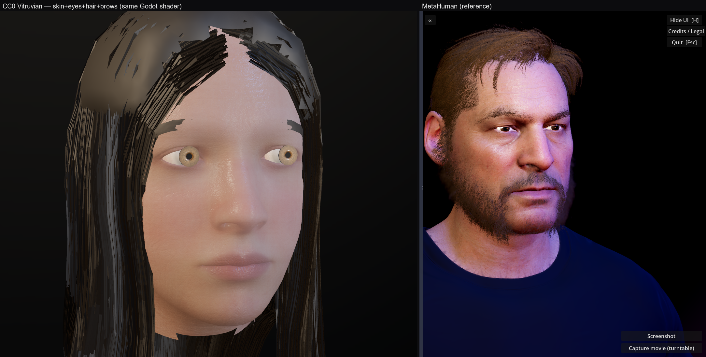

# VitruvianGodot

Photoreal CC0 human head in **stock Godot 4.6 Forward+**, rendered through the
MatMADNESS skin-shader stack. A fully **EULA-free** alternative to the
[MetaHumanGodot](https://github.com/ibrews/MetaHumanGodot) pipeline — the base
mesh is the **"Vitruvian"** character from the [CharMorph](https://github.com/Upliner/CharMorph)
Blender add-on, shipped under **CC0**. No Epic MetaHuman EULA, so the assets can
be redistributed, cloud-rendered, and used in closed-source commercial products.



*Left: CC0 Vitruvian head — skin + eyes + tone + eyebrows, lit through the same
`skin_shader_local.gdshader` the MetaHuman pipeline uses. Right: a finished
MetaHuman for reference.*

## Why this exists
The MetaHuman→Godot pipeline produces great results but carries Epic's EULA,
which blocked a cloud-subscription product. Vitruvian is CC0, so this repo can
do everything the MetaHuman one legally can't. The **rendering tech is
identical** — same Godot Forward+, same AgX + SSIL + screen-space SSS, same
MatMADNESS shaders. Only the source mesh changed.

## Run it
```
# Stock Godot 4.6
Godot_v4.6 --path godot_project scenes/vitruvian_lookdev.tscn
```
Orbit: LMB drag · wheel zoom · RMB/MMB pan.

Headless-ish verification capture (windowed, needs a GPU):
```
set NO_LOAD_SETTINGS=1
set LOOKDEV_CAPTURE=out/g
Godot_v4.6 --path godot_project scenes/vitruvian_lookdev.tscn --resolution 1280x1280
# writes out/g_a.png (clean) + out/g_b.png (SSS pushed), then quits
```

## Repo layout
```
godot_project/        Godot 4.6 project (Forward+)
  scenes/
    skin_shader_local.gdshader   MatMADNESS skin (SSS, micro-detail, scatter)
    eye / hair_* .gdshader        rest of the shader stack (for future use)
    vitruvian_lookdev.{gd,tscn}   the look-dev / capture scene
    probe_vitruvian.gd            headless surface dumper
  vitruvian_head.glb              CC0 head (skin/sclera/iris/pupil/mouth + brows)
  vit_*.png                       CC0 face/eye textures (extracted UDIM tile 1001/1005/1007)
blender_prep/         Blender 4.5 scripts that produce the GLB + textures
docs/                 comparison + hero renders
```

## How the head is prepared (`blender_prep/`)
CharMorph ships Vitruvian as a 1.12 GB data pack (base `char.blend` + 4K **UDIM**
EXR textures). `export_vitruvian_head.py` (run via
`blender --background char.blend --python ...`):
1. strips particle grooms, isolates the head (`z >= 1.49`);
2. splits surfaces by **UDIM tile** — skin (1001), sclera (1005), mouth (1006),
   iris (1007) — plus the original eye material indices to drop the clear
   cornea/aqueous shells that would occlude the iris;
3. nudges iris+pupil proud of the sclera so they read frontally;
4. appends the eyebrow groom mesh from `eyebrows.blend`;
5. exports a Y-up GLB and extracts textures: a **tone-blended albedo**
   (`skin_light_col` × `skin_dark_col` LUT), roughness (`skin_cavity_rough_coat`),
   and a **tangent normal derived from the displacement EXR** (Vitruvian ships no
   TS normal map), plus sclera/iris/mouth color.

## Status & TODO
Working: skin (full SSS), eyes (iris/pupil/sclera from Vitruvian's own eye
textures), skin tone, eyebrows, and **scalp hair**. The hair is built from the
CharMorph hairstyle's guide strands (`hairstyles/*.npz`) as cross-section
ribbons densified with jittered children + a dark scalp cap — see
`blender_prep/build_vitruvian_hair.py`. It's a spike-grade groom, not a full
card-with-alpha-atlas system, so it reads best at portrait framing.

The look-dev scene is the **full interactive tool**: a live slider panel (skin
SSS/normal/roughness/specular, the three lights + catchlight, environment
exposure/saturation/contrast/backdrop, hair/scalp/brow colour, camera FOV/DOF),
orbit + auto-turntable + hero camera, per-setting reset, save/load presets, and
screenshot / turntable-movie capture — the same controls as the MetaHuman
look-dev tool, here with zero MetaHuman assets.

Not yet done:
- **Hair polish** — proper hair cards with an alpha atlas + a dedicated hair
  shader; denser crown; eyelashes.
- **Body** (UDIM tiles 1002–1004 → per-tile texture split + wiring).
- **Proper normal bake** (currently a displacement-gradient approximation) and a
  scatter/thickness map.

See `NOTICE.md` for licenses/credits.
